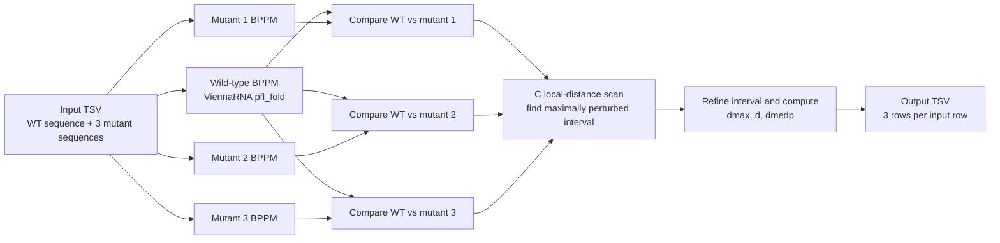

# bulkRNAsnp

<p align="center">
  <strong>High-throughput scoring of local RNA secondary-structure changes caused by single-nucleotide substitutions</strong>
</p>

<p align="center">
  
  
  
</p>

`bulkRNAsnp` is a lightweight batch-processing workflow for quantifying how single-nucleotide substitutions alter **local RNA secondary-structure ensembles**.

For each input sequence, the program evaluates the three alternative nucleotide substitutions supplied by the user. It computes local base-pairing probability matrices with the [ViennaRNA Package](https://www.tbi.univie.ac.at/RNA/), compares each mutant with the wild type, identifies the interval with the strongest structural perturbation, and reports several structural-distance summaries.

The local comparison strategy is based on the ideas introduced in **RNAsnp** by Sabarinathan *et al.* (2013), but this repository is a focused batch implementation rather than a complete reimplementation of RNAsnp. In particular, it does **not** calculate RNAsnp empirical P-values.

---

## Why bulkRNAsnp?

A single nucleotide change can alter an RNA's ensemble of possible secondary structures even when the primary sequence changes by only one base. Evaluating this effect at scale can become expensive because each variant requires folding both wild-type and mutant sequences and then comparing their base-pairing probabilities.

`bulkRNAsnp` is designed for a simple high-throughput use case:

- process many focal sites from a tab-separated table;
- evaluate **three mutant alleles per wild-type sequence**;
- compute the wild-type base-pairing probabilities only once per input row;
- use compiled C code for the local structural-distance scan; and
- return one tidy output row per tested substitution.

---

## Workflow



At a high level, the calculation is:

1. **Fold the wild-type sequence locally** with ViennaRNA and construct a base-pairing probability matrix (BPPM).
2. **Fold each of the three mutant sequences** using the same settings.
3. **Compare wild-type and mutant BPPMs** using a C implementation of a local squared-difference scan inspired by the RNAsnp local-distance strategy.
4. **Locate the interval of strongest structural change** and refine its end position.
5. **Summarize the perturbation**, including a median change in pairing probability (`dmedp`).
6. Write one output row for each mutant allele.

---

## Repository structure

```text
bulkRNAsnp/
├── RNAsnp.py   # Python driver: I/O, ViennaRNA folding, matrix construction and summary statistics
├── rnasnp.c    # C implementation of the local BPPM-distance scan
└── rnasnp.so   # Precompiled shared library used by RNAsnp.py
```

---

## Requirements

### Python dependencies

- Python 3
- `numpy`
- `pandas`
- ViennaRNA Python bindings

The ViennaRNA Python interface can be installed from PyPI together with the other Python dependencies:

```bash
python -m pip install numpy pandas viennarna
```

The script uses:

```python
from ViennaRNA import RNA
```

which is supported by current ViennaRNA Python distributions.

### C shared library

A precompiled `rnasnp.so` is included in the repository. The bundled file is a **64-bit x86 Linux shared object**.

If it is incompatible with your system, rebuild it from `rnasnp.c`:

```bash
gcc -O3 -shared -fPIC rnasnp.c -o rnasnp.so
```

> **Important:** `RNAsnp.py` currently loads the library using `./rnasnp.so`, so the simplest way to run the program is from the repository directory.

---

## Installation

```bash
git clone https://github.com/MikeACG/bulkRNAsnp.git
cd bulkRNAsnp

python -m venv .venv
source .venv/bin/activate
python -m pip install --upgrade pip
python -m pip install numpy pandas viennarna
```

If necessary, rebuild the C library:

```bash
gcc -O3 -shared -fPIC rnasnp.c -o rnasnp.so
```

---

## Input format

The input is a **tab-separated file with a header**. Each row describes one wild-type sequence and three corresponding mutant sequences.

The following columns are required by the current script:

| Column | Description |
|---|---|
| `seq` | Wild-type nucleotide sequence. |
| `mutant1` | Sequence carrying the first alternative allele. |
| `mutant2` | Sequence carrying the second alternative allele. |
| `mutant3` | Sequence carrying the third alternative allele. |
| `snp1` | Label for `mutant1`, typically the alternative nucleotide. |
| `snp2` | Label for `mutant2`, typically the alternative nucleotide. |
| `snp3` | Label for `mutant3`, typically the alternative nucleotide. |
| `transcript_id` | Transcript identifier; copied to the output. |
| `position` | Focal position in the sequence/transcript; copied to the output. |
| `wt` | Wild-type nucleotide at the focal position; copied to the output. |
| `position.abs` | Absolute/genomic position metadata; copied to the output. |
| `chr` | Chromosome metadata; copied to the output. |

### Input assumptions

- `seq`, `mutant1`, `mutant2`, and `mutant3` should have the **same length**.
- The workflow is intended for single-nucleotide substitutions, so each mutant sequence should normally differ from `seq` only at the focal position.
- The script does not currently validate these assumptions.
- Sequence length (`n`) is calculated automatically from `seq`.

---

## Usage

From the repository directory:

```bash
python RNAsnp.py input.tsv output.tsv
```

For example:

```bash
python RNAsnp.py data/variants.tsv results/rna_structure_effects.tsv
```

During execution, the script prints progress messages and reports every 1,000 input rows.

---

## Output format

Each input row generates **three output rows**, one for each mutant sequence.

| Column | Description |
|---|---|
| `start` | Start of the locally perturbed interval, using the BPPM's 1-based sequence coordinates. |
| `end` | End of the locally perturbed interval, using 1-based sequence coordinates. |
| `dmax` | Maximum squared BPPM-difference score from the initial local scan. |
| `d` | Refined structural-distance score for the selected interval. The squared BPPM differences are normalized by the interval span in the C routine. |
| `dmedp` | Median change in per-position pairing probability within the selected interval (`mutant - wild type`). Positive values indicate increased local pairing probability in the mutant; negative values indicate decreased pairing probability. |
| `snp` | Mutant label taken from `snp1`, `snp2`, or `snp3`. |
| `transcript_id` | Copied from the input. |
| `position` | Copied from the input. |
| `wt` | Copied from the input. |
| `position.abs` | Copied from the input. |
| `chr` | Copied from the input. |
| `n` | Length of the wild-type sequence. |

### Edge cases

If a valid structural interval cannot be calculated, `start` and `end` are written as `-1`.

- If the wild-type and mutant BPPMs are exactly identical, the three structural scores are returned as `0`.
- Otherwise, uncomputable structural scores are returned as missing values and written as `NA`.

---

## Method details

### 1. Local base-pairing probabilities

For every sequence, `RNasnp.py` calls ViennaRNA's `RNA.pfl_fold()` with:

```text
W = 200
L = 150
cutoff = 0.0
```

The resulting base-pairing probabilities are stored in a symmetric `(n + 1) x (n + 1)` matrix. The extra row and column preserve the 1-based sequence coordinates returned by ViennaRNA.

The wild-type BPPM is calculated once per input row and reused for all three mutant comparisons.

### 2. Local structural-distance scan

The wild-type and mutant matrices are passed to `compute_bpd()` in `rnasnp.c` through Python's `ctypes` interface.

The current scan uses fixed parameters:

```text
regionX = 20
regionY = 150
```

The C routine searches for the sequence position at which the local sum of squared differences between the two BPPMs is largest. It then evaluates candidate interval end points downstream of that position to identify a refined interval and distance score.

Conceptually, larger `dmax` or `d` values indicate a larger difference between the wild-type and mutant base-pairing probability landscapes under these settings.

### 3. Median pairing-probability change

For the selected interval, `dmedp` is calculated in Python as the median across positions of:

```text
sum(mutant BPPM row) - sum(wild-type BPPM row)
```

using only base pairs whose two positions lie inside the selected interval.

This provides a directional summary complementary to the non-directional squared-distance scores: it indicates whether pairing probability tends to increase or decrease in the mutant within the affected region.

---

## Relationship to RNAsnp

This project is inspired by the local structural-comparison strategy described in RNAsnp, which identifies regions in which a nucleotide substitution maximally perturbs RNA base-pairing probabilities.

However, `bulkRNAsnp` should not be interpreted as a drop-in replacement for the full RNAsnp software:

- it uses a specific batch-oriented input format;
- its ViennaRNA and local-scan parameters are hard-coded in the current implementation;
- it evaluates the three mutant sequences supplied for every input row;
- it adds the custom `dmedp` statistic; and
- it does **not** compute the empirical significance/P-values reported by RNAsnp.

If you require the complete RNAsnp statistical framework, refer to the original RNAsnp software and publications.

---

## Performance notes

A comment in the current implementation records an example run of approximately **14,590 input rows** with a median sequence length of approximately **401 nt**:

- runtime: about **5.3 hours**;
- peak memory: about **454 MB**;
- environment: a heterogeneous computing cluster, with substantial node-to-node runtime variation.

These numbers should be treated only as a rough historical benchmark. Runtime depends on sequence length, ViennaRNA version, CPU performance, and the compute environment.

Because each input row evaluates three mutants, 14,590 input rows correspond to 43,770 wild-type/mutant comparisons while reusing the wild-type fold within each group of three.

---

## Current limitations

- Exactly three mutant sequences are expected for every input row.
- Folding and scan parameters are currently hard-coded.
- Input sequences and mutation relationships are not validated.
- The Python loop is single-process; parallelization is expected to be handled externally, for example by splitting input files across cluster jobs.
- The shared-library path is relative to the current working directory.
- Dependency versions are not pinned.
- There is currently no automated test suite.
- No RNAsnp empirical P-values are calculated.

---

## Possible extensions

Useful future additions could include:

- an `argparse` command-line interface;
- configurable `W`, `L`, `regionX`, and `regionY` parameters;
- automatic discovery of `rnasnp.so` relative to the script location;
- built-in multiprocessing or chunked execution;
- input validation and clearer error messages;
- a reproducible Conda/environment file;
- unit tests against known sequence/mutation pairs; and
- optional output of additional BPPM-derived statistics.

---

## References

If you use the structural-comparison approach in scientific work, please consider citing the original RNAsnp and ViennaRNA publications.

**RNAsnp**

> Sabarinathan R, Tafer H, Seemann SE, Hofacker IL, Stadler PF, Gorodkin J.  
> *RNAsnp: efficient detection of local RNA secondary structure changes induced by SNPs.*  
> Human Mutation. 2013;34(4):546–556.  
> https://doi.org/10.1002/humu.22273

**ViennaRNA Package 2.0**

> Lorenz R, Bernhart SH, Höner zu Siederdissen C, Tafer H, Flamm C, Stadler PF, Hofacker IL.  
> *ViennaRNA Package 2.0.*  
> Algorithms for Molecular Biology. 2011;6:26.  
> https://doi.org/10.1186/1748-7188-6-26

---

## Acknowledgement

The local structural-distance calculation implemented here is based on concepts introduced by the RNAsnp authors and relies on the ViennaRNA Package for RNA secondary-structure ensemble calculations.
